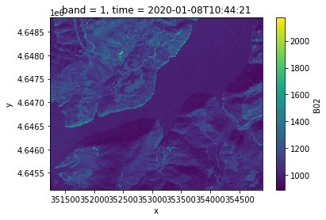
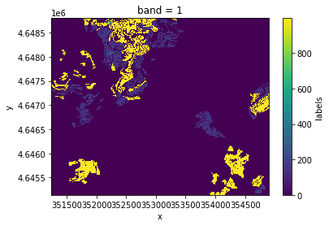
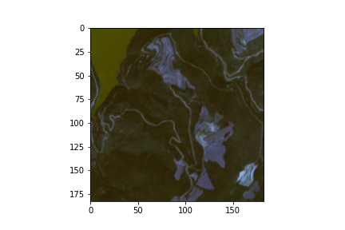
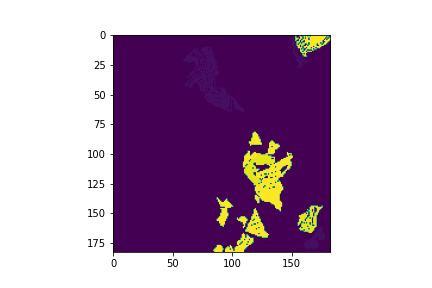

## Sen4AgriNet

#### A Sentinel-2 multi-year, multi-country benchmark dataset for crop classification and segmentation with deep learning


**Authors:** Dr. Dimitris Sykas, Dr. Ioannis Papoutsis, Dimitrios Zografakis, Maria Sdraka

---

This repository provides a native PyTorch Dataset Class for Sen4AgriNet dataset. Should work with any new version of PyTorch1.7.1+ and Python3.8.5+.

Dataset heavily relies on [cocoapi](https://github.com/cocodataset/cocoapi) for dataloading and indexing, therefore make sure you have it installed:
```python
pip3 install pycocotools
```

Then make sure every other requirement is installed:
```python
pip3 install -r requirements.txt
```

### Instructions

In order to use the provided PyTroch Dataset class, the required netCDF files of Sen4AgriNet must be downloaded ([Dropbox](https://www.dropbox.com/sh/2arxz9d7fffg0xb/AADqlPtOoo4aCYAtmo2XzN5ta/netcdf?dl=0&subfolder_nav_tracking=1)) and placed inside the `dataset/netcdf/` folder.

Then, three separate COCO files must be created: one for training, one for validation and one for testing.

After this initial setup, `patches_dataset.py` can be used in a PyTorch deep learning pipeline to load, prepare and return patches from the dataset according to the split dictated by the COCO files. This Dataset class has the following features:
 - Reads the netCDF files of the dataset containing the Sentinel-2 observations over time and the corresponding labels.
 - Isolates the Sentinel-2 bands requested by the user.
 - Computes the median Sentinel-2 image on a given frequency, e.g. monthly (or loads precomputed medians, if any).
 - Returns the timeseries of median images inside a predefined window.
 - Normalizes the images.
 - Returns hollstein masks for clouds, cirrus, shadow or snow.
 - Returns a parcel mask: 1 for parcel, 0 for non-parcel.
 - Can alternatively return binary labels: 1 for crops, 0 for non-crops.

### Dataset exploration

This is roughly the way that our `patches_dataset.py` works. The whole procedure is also described in the provided [notebook](https://github.com/Orion-AI-Lab/S4A/blob/main/patch_aggregation_visualization.ipynb).

1. Open a netCDF file for exploration.

```python3
import netCDF4
from pathlib import Path

patch = netCDF4.Dataset(Path('data/2020_31TCG_patch_14_14.nc'), 'r')
patch
```

Outputs
```python3
"""
<class 'netCDF4._netCDF4.Dataset'>
root group (NETCDF4 data model, file format HDF5):
    title: S4A Patch Dataset
    authors: Papoutsis I., Sykas D., Zografakis D., Sdraka M.
    patch_full_name: 2020_31TCG_patch_14_14
    patch_year: 2020
    patch_name: patch_14_14
    patch_country_code: ES
    patch_tile: 31TCG
    creation_date: 27 Apr 2021
    references: Documentation available at .
    institution: National Observatory of Athens.
    version: 21.03
    _format: NETCDF4
    _nco_version: netCDF Operators version 4.9.1 (Homepage = http://nco.sf.net, Code = http://github.com/nco/nco)
    _xarray_version: 0.17.0
    dimensions(sizes):
    variables(dimensions):
    groups: B01, B02, B03, B04, B05, B06, B07, B08, B09, B10, B11, B12, B8A, labels, parcels
"""
```
2. Visualize a single timestamp.

```python3
import xarray as xr

band_data = xr.open_dataset(xr.backends.NetCDF4DataStore(patch['B02']))
band_data.B02.isel(time=0).plot()
```



3. Visualize the labels:

```python3
labels = xr.open_dataset(xr.backends.NetCDF4DataStore(patch['labels']))
labels.labels.plot()
```


4. Visualize the parcels:

```python3
parcels = xr.open_dataset(xr.backends.NetCDF4DataStore(patch['parcels']))
parcels.parcels.plot()
```


5. Plot the median of observations for each month:

```python3
import pandas as pd
# Or maybe aggregate based on a given frequency
# Refer to
# https://pandas.pydata.org/pandas-docs/stable/user_guide/timeseries.html#timeseries-offset-aliases
group_freq = '1MS'

# Grab year from netcdf4's global attribute
year = patch.patch_year

# output intervals
date_range = pd.date_range(start=f'{year}-01-01', end=f'{int(year) + 1}-01-01', freq=group_freq)

# Aggregate based on given frequency
band_data = band_data.groupby_bins(
    'time',
    bins=date_range,
    right=True,
    include_lowest=False,
    labels=date_range[:-1]
).median(dim='time')
```

If you plot right now, you might notice that some months are empty:


(Optional) Fill in empty months:

```python3
import matplotlib.pyplot as plt

band_data = band_data.interpolate_na(dim='time_bins', method='linear', fill_value='extrapolate')

fig, axes = plt.subplots(nrows=3, ncols=4, figsize=(18, 12))

for i, season in enumerate(band_data.B02):

    ax = axes.flat[i]
    cax = band_data.B02.isel(time_bins=i).plot(ax=ax)


for i, ax in enumerate(axes.flat):
    ax.axes.get_xaxis().set_ticklabels([])
    ax.axes.get_yaxis().set_ticklabels([])
    ax.axes.axis('tight')
    ax.set_xlabel('')
    ax.set_ylabel('')
    ax.set_title(f'Month: {i+1}')


plt.tight_layout()
plt.show()
```


### PatchesDataset usage example

Please refer to the provided [notebook](https://github.com/Orion-AI-Lab/S4A/blob/main/s4a-dataloaders.ipynb) for a detailed usage example of the provided `PatchesDataset`.

1. Read the COCO file to be used.
```python3
from pathlib import Path
from pycocotools.coco import COCO
root_path_coco = Path('coco_files/')
coco_train = COCO(root_path_coco / 'coco_example.json')
```

2. Initialize the PatchesDataset.
```python3
from torch.utils.data import DataLoader
from patches_dataset import PatchesDataset
from utils.config import LINEAR_ENCODER
root_path_netcdf = Path('dataset/netcdf')  # Path to the netCDF files
dataset_train = PatchesDataset(root_path_netcdf=root_path_netcdf,
                               coco=coco_train,
                               group_freq='1MS',
                               prefix='test_patchesdataset',
                               bands=['B02', 'B03', 'B04'],
                               linear_encoder=LINEAR_ENCODER,
                               saved_medians=False,
                               window_len=6,
                               requires_norm=False,
                               return_masks=False,
                               clouds=False,
                               cirrus=False,
                               shadow=False,
                               snow=False,
                               output_size=(183, 183)
                              )
```

3. Initialize the Dataloader.
```python3
dataloader_train = DataLoader(dataset_train,
                              batch_size=1,
                              shuffle=True,
                              num_workers=4,
                              pin_memory=True
                             )
```

4. Get a batch.
```python3
batch = next(iter(dataloader_train))
```

The `batch` variable is a dictionary containing the keys: `medians`, `labels`, `idx`.
`batch['medians']` contains a pytorch tensor of size `[1, 6, 3, 183, 183]` where:
  - batch size: 1
  - timestamps: 6
  - bands: 3
  - height: 183
  - width: 183



`batch['labels']` contains the corresponding labels of the medians, which is a pytorch tensor of size `[1, 183, 183]` where:
  - batch size: 1
  - height: 183
  - width: 183



`batch['idx']` contains the index of the returned timeseries.

### Webpage

Dataset Webpage: https://www.sen4agrinet.space.noa.gr/

### Experiments

Please visit [S4A-Models](https://github.com/Orion-AI-Lab/S4A-Models) for a complete experimentation pipeline using the Sen4AgriNet dataset. 

### Citation

To cite please use:
```
@ARTICLE{
  9749916,
  author={Sykas, Dimitrios and Sdraka, Maria and Zografakis, Dimitrios and Papoutsis, Ioannis},
  journal={IEEE Journal of Selected Topics in Applied Earth Observations and Remote Sensing},
  title={A Sentinel-2 multi-year, multi-country benchmark dataset for crop classification and segmentation with deep learning},
  year={2022},
  doi={10.1109/JSTARS.2022.3164771}
}
```
