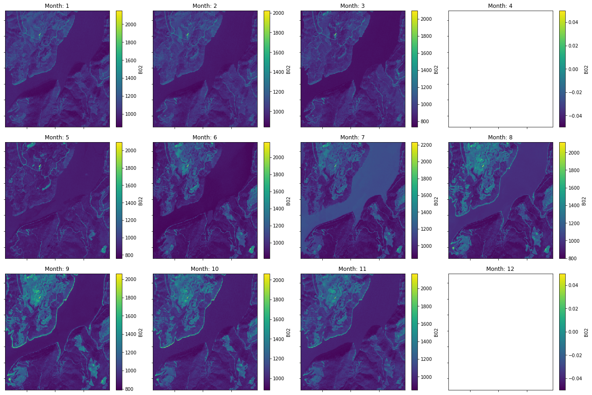
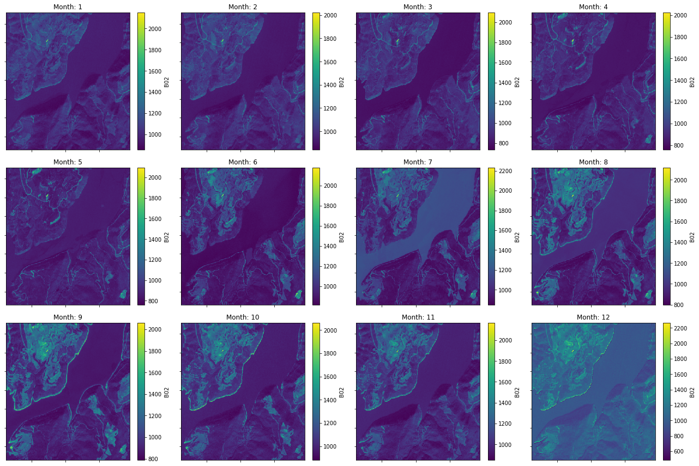

## SEN4AGRINET: A HARMONIZED MULTI-COUNTRY, MULTI-TEMPORAL BENCHMARK DATASET FOR AGRICULTURAL EARTH OBSERVATION MACHINE LEARNING APPLICATIONS


#### Authors: Dr. Dimitris Sykas, Dr. Ioannis Papoutsis, Dimitrios Zografakis

---

#### Highly recommended to read Notebook [#1](https://github.com/Orion-AI-Lab/S4A/blob/main/patch_aggregation_visualization.ipynb) and [#2](https://github.com/Orion-AI-Lab/S4A/blob/main/s4a-dataloaders.ipynb).

This repository provides a native PyTorch Dataset Class for Sen4AgriNet dataset. Should work with any new version of PyTorch1.7.1+ and Python3.8.5+.

Dataset heavily relies on [cocoapi](https://github.com/cocodataset/cocoapi) for dataloading and indexing, therefore make sure you have it installed:
```python
pip3 install pycocotools
```

Then make sure every other requirement is installed:
```python
pip3 install -r requirements.txt
```

### Example usage

```python3
import netCDF4
from pathlib import Path

patch = netCDF4.Dataset(Path('data/2020_31TCG_patch_14_14.nc'), 'r')
patch
```

Outputs
```python3
"""
<class 'netCDF4._netCDF4.Dataset'>
root group (NETCDF4 data model, file format HDF5):
    title: S4A Patch Dataset
    authors: Papoutsis I., Sykas D., Zografakis D., Sdraka M.
    patch_full_name: 2020_31TCG_patch_14_14
    patch_year: 2020
    patch_name: patch_14_14
    patch_country_code: ES
    patch_tile: 31TCG
    creation_date: 27 Apr 2021
    references: Documentation available at .
    institution: National Observatory of Athens.
    version: 21.03
    _format: NETCDF4
    _nco_version: netCDF Operators version 4.9.1 (Homepage = http://nco.sf.net, Code = http://github.com/nco/nco)
    _xarray_version: 0.17.0
    dimensions(sizes):
    variables(dimensions):
    groups: B01, B02, B03, B04, B05, B06, B07, B08, B09, B10, B11, B12, B8A, labels, parcels
"""
```

#### Visualization

Plot single timestamp:
```python3
import xarray as xr

band_data = xr.open_dataset(xr.backends.NetCDF4DataStore(patch['B02']))
band_data.B02.isel(time=0).plot()
```


Or plot labels:
```python3
labels = xr.open_dataset(xr.backends.NetCDF4DataStore(patch['labels']))
labels.labels.plot()
```


Or plot parcels:
```python3
parcels = xr.open_dataset(xr.backends.NetCDF4DataStore(patch['parcels']))
parcels.parcels.plot()
```


#### Aggregation

Plot the median of observations for each month:

```python3
import pandas as pd
# Or maybe aggregate based on a given frequency
# Refer to
# https://pandas.pydata.org/pandas-docs/stable/user_guide/timeseries.html#timeseries-offset-aliases
group_freq = '1MS'

# Grab year from netcdf4's global attribute
year = patch.patch_year

# output intervals
date_range = pd.date_range(start=f'{year}-01-01', end=f'{int(year) + 1}-01-01', freq=group_freq)

# Aggregate based on given frequency
band_data = band_data.groupby_bins(
    'time',
    bins=date_range,
    right=True,
    include_lowest=False,
    labels=date_range[:-1]
).median(dim='time')
```

If you plot right now, you might notice that some months are empty:


(Optional) Fill in empty months:

```python3
band_data = band_data.interpolate_na(dim='time_bins', method='linear', fill_value='extrapolate')
```

Plot them:
```python3
import matplotlib.pyplot as plt

fig, axes = plt.subplots(nrows=3, ncols=4, figsize=(18, 12))

for i, season in enumerate(band_data.B02):

    ax = axes.flat[i]
    cax = band_data.B02.isel(time_bins=i).plot(ax=ax)


for i, ax in enumerate(axes.flat):
    ax.axes.get_xaxis().set_ticklabels([])
    ax.axes.get_yaxis().set_ticklabels([])
    ax.axes.axis('tight')
    ax.set_xlabel('')
    ax.set_ylabel('')
    ax.set_title(f'Month: {i+1}')


plt.tight_layout()
plt.show()
```


### Webpage

Dataset Webpage: https://www.sen4agrinet.space.noa.gr/

### Citation

To cite please use:
```text

@INPROCEEDINGS{9553603,
  author={Sykas, Dimitris and Papoutsis, Ioannis and Zografakis, Dimitrios},
  booktitle={2021 IEEE International Geoscience and Remote Sensing Symposium IGARSS},
  title={Sen4AgriNet: A Harmonized Multi-Country, Multi-Temporal Benchmark Dataset for Agricultural Earth Observation Machine Learning Applications},
  year={2021},
  volume={},
  number={},
  pages={5830-5833},
  doi={10.1109/IGARSS47720.2021.9553603}}

```
